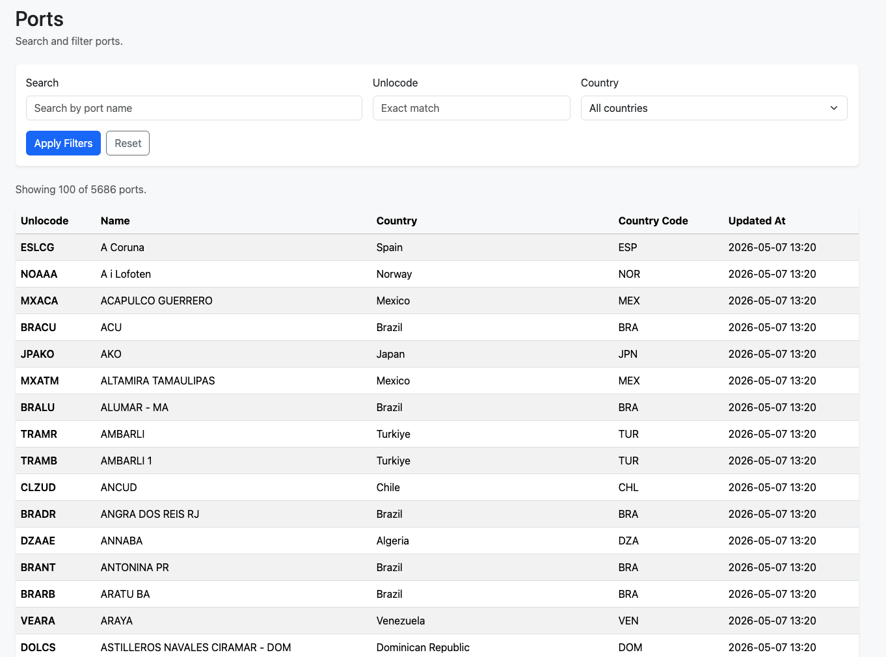

# Ports

Small Laravel application that:

- fetches ports from the Risk4Sea API
- stores them locally in MySQL / SQLite
- provides a simple web UI with filters and pagination
- exposes a paginated JSON API

The project was built incrementally with small commits and includes a few senior-level enhancements such as layered sync architecture, retry logic, queued sync jobs, cache-backed listings, index analysis notes, sequence diagrams, and a conceptual multi-tenant expansion note.

## Features

### Core Assignment

- Risk4Sea API integration for `List all ports`
- local `ports` table with indexing for search and upsert
- queued sync command
- web UI on `/`
- REST API on `/api/ports`
- seeding support to reach `10,000` rows

### Implemented Enhancements

- layered architecture with DTO, repository, and sync service
- retry/backoff and clearer API error handling
- queue-based sync execution
- cached port listings and cached country dropdown
- index analysis note
- sequence diagrams
- conceptual multi-tenant expansion note
- feature tests

## Tech Stack

- PHP `8.4`
- Laravel `13`
- SQLite for local development by default
- Pest for testing

## Routes

- Web UI: `GET /`
- API: `GET /api/ports`

## Database Design

The `ports` table includes:

- `id`
- `unlocode` `varchar(20)` unique
- `name` `varchar(255)`
- `country_name` `varchar(100)`
- `country_code` `varchar(100)`
- `updated_at` timestamp

Indexes:

- `unique(unlocode)`
- `index(name)`
- `index(country_code)`
- `index(country_code, name)`

## Environment Variables

Add these values to `.env`:

```env
RISK4SEA_BASE_URL=https://lab.risk4sea.com
RISK4SEA_PORTS_PATH=/api/v1/port-calls/ports
RISK4SEA_TOKEN=your_token_here
RISK4SEA_TIMEOUT=15
RISK4SEA_CONNECT_TIMEOUT=5
RISK4SEA_RETRY_TIMES=3
RISK4SEA_RETRY_SLEEP_MS=300
RISK4SEA_LIST_CACHE_TTL=10
```

Notes:

- `RISK4SEA_TOKEN` is required for sync
- listing cache TTL is in minutes
- local testing uses `CACHE_STORE=array`, so production-like persistent cache behavior is not required for test runs

## Installation

### 1. Install dependencies

```bash
composer install
npm install
```

### 2. Create environment file

```bash
cp .env.example .env
php artisan key:generate
```

### 3. Prepare database

If you use the default SQLite setup:

```bash
touch database/database.sqlite
php artisan migrate
```

If you prefer MySQL, update `.env` and run:

```bash
php artisan migrate
```

### 4. Build frontend assets

```bash
npm run build
```

For local development:

```bash
npm run dev
```

## Running the Application

Start the Laravel server:

```bash
php artisan serve
```

The home page is:

```text
/
```

## Sync Flow

The sync command now dispatches a queued job instead of running the import inline.

### Dispatch a sync job

```bash
php artisan r4s:sync-ports
```

Optional filtered sync:

```bash
php artisan r4s:sync-ports --search=span
```

### Run the queue worker

```bash
php artisan queue:work
```

What the sync does:

- calls Risk4Sea
- normalizes payloads
- validates required fields
- deduplicates rows by `unlocode`
- upserts into `ports`
- clears the cached countries dropdown
- logs sync summary counts

## Seeding to 10,000 Rows

To fill the table up to at least `10,000` rows:

```bash
php artisan db:seed --class=PortSeeder
```

Or run the default seeder:

```bash
php artisan db:seed
```

The `PortSeeder` only adds the missing rows needed to reach `10,000`.

## Web UI

The web UI is available at:

```text
/
```

Screenshot:



Filters:

- `search` by port name
- exact `unlocode`
- `country_code` from dropdown

Behavior:

- `100` rows per page
- server-side pagination
- listing cache by filter set and page
- cached country dropdown

## REST API

Endpoint:

```text
GET /api/ports
```

Supported query parameters:

- `search`
- `unlocode`
- `country_code`
- `page`

Example:

```bash
curl "http://localhost:8000/api/ports?country_code=ESP&search=port"
```

Response shape:

- `data`
- `links`
- `meta`

Each item contains:

- `id`
- `unlocode`
- `name`
- `country.name`
- `country.code`
- `updated_at`

## Testing

Run all tests:

```bash
php artisan test
```

Run feature tests only:

```bash
php artisan test tests/Feature
```

Current coverage includes:

- web listing filters
- API listing filters and paginated JSON
- sync command queue dispatch behavior

## Architecture Notes

### Sync Layer

- `App\Services\Risk4SeaClient`
- `App\Data\PortData`
- `App\Repositories\PortRepository`
- `App\Services\PortSyncService`
- `App\Jobs\SyncPortsJob`
- `App\Console\Commands\SyncPorts`

### Listing Layer

- `App\Services\PortListingService`
- `App\Http\Controllers\PortController`
- `App\Http\Controllers\Api\PortController`

## Extra Documentation

- Index analysis: [docs/index-analysis.md](docs/index-analysis.md)
- Sequence diagrams: [docs/sequence-diagrams.md](docs/sequence-diagrams.md)
- Multi-tenant expansion note: [docs/multi-tenant-expansion.md](docs/multi-tenant-expansion.md)

## Known Tradeoffs

- name search uses `LIKE '%term%'`, which is acceptable for this assignment size but is not ideal for larger datasets
- countries cache is explicitly invalidated after sync, while listing cache relies on TTL to avoid unnecessary invalidation complexity
- local development currently defaults to SQLite, but the app structure is compatible with MySQL

## Submission Summary

This project delivers:

- API ingestion from Risk4Sea
- local persistence
- searchable and paginated web UI
- paginated JSON API
- queue-driven sync execution
- practical architecture and documentation notes for scaling the solution further
