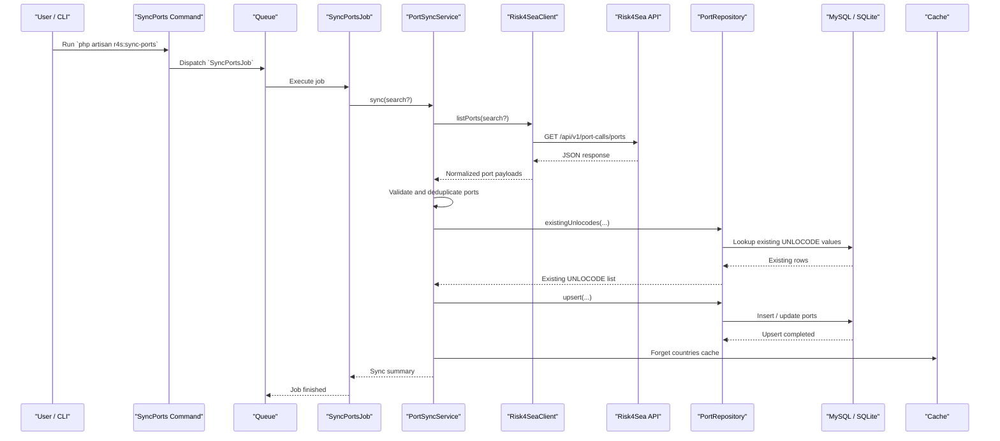
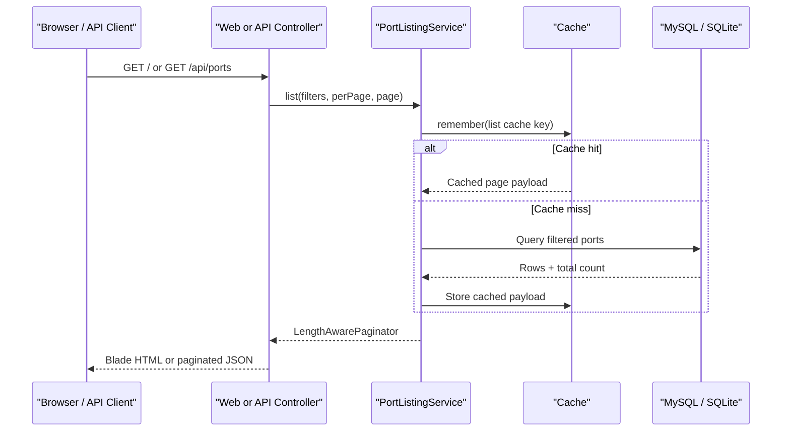

# UML / Sequence Diagrams

These diagrams describe the two main flows of the application:

1. syncing ports from Risk4Sea into the local database
2. reading ports through the web UI or API with cached listing results

## 1. Sync Flow

### Notes

- the command no longer performs the sync inline; it dispatches a queued job
- the service owns the sync orchestration logic
- the repository owns the database persistence logic
- the countries cache is explicitly cleared after a successful sync

## 2. Listing / Read Flow

### Notes

- the web controller and API controller share the same listing service
- paginated listing results are cached by filter set and page number
- the country dropdown uses a separate fixed cache key
- this keeps the read flow fast without changing the public API of the controllers
